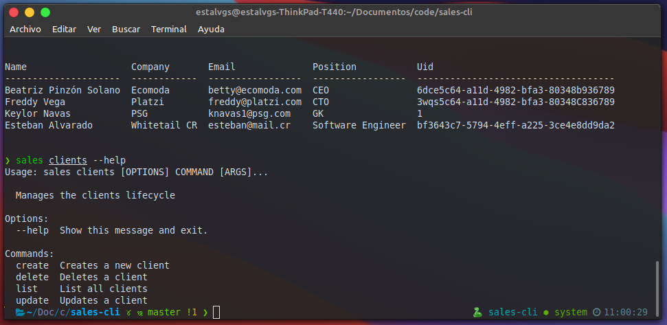

# Sales CLI 🛡

<!-- GitHub Badges -->
[](https://www.python.org/)
[](https://www.conventionalcommits.org/en/v1.0.0/)
[](https://pypi.python.org/pypi/ansicolortags/)
[](https://GitHub.com/Naereen/StrapDown.js/tags/)

`sales` is the command line application that allows you to manage the sales of your company. It brings you to manage customers, sales, inventories and generate quick reports.



Sales CLI is built in python and available for use on macOS, Windows, and Linux.

## How to use it? 🚀

To install this tool you can clone the repository or download the zip file.

1. To integrate it with the system you must first create a virtual environment\
```$ virtualenv venv```
2. Then you must initialize the virtual environment\
```$ source venv/bin/activate```
3. Finally install the application on your system\
```$ pip install --editable .```

Check the use of the commands\
 ```$ sales --help```
## Authors

I have developed this project on my way to becoming an Python professional.

* **Esteban Alvarado** - *Software Developer* - [@estalvgs1999](https://github.com/estalvgs1999)

This project has been developed as part of Platzi's **CRUD with python** course. The thanks for this project go to [Platzi](https://platzi.com/clases/python-practico/)!

## License 📄

This project is licensed under the GNU License - see the [LICENSE.md](https://github.com/estalvgs1999/PLJS02-Typescript-Fundamentals/blob/master/LICENSE) file for details

---

<p align="center">

</p>
